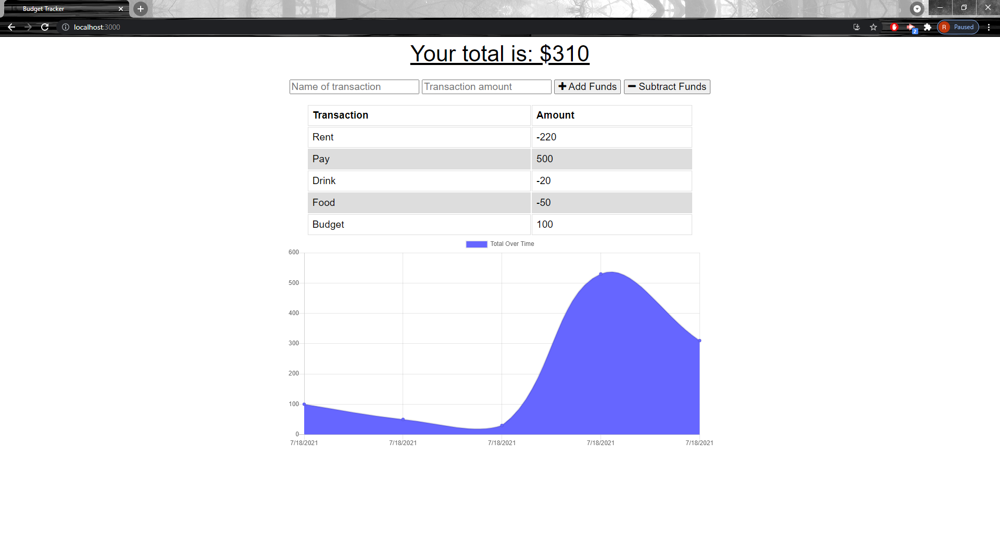

# Budget Tracker

## Description

This budget tracking app allows users to monitor their transactions through adding or subracting funds. This applications makes use of a service worker to cache all static files and online transactions, allowing them to be accessed offline. The browsers api, 'IndexedDB' is then utilized to store any offline transactions. If an online connection is established again, all transactions are dynamically updated giving users access to both an online and offline budget tracker. This is a progressive web app and is able to be installed on any device.

## Table of Contents

[Usage](#usage)

[Screenshots](#screenshots)

[License](#license)

[Contribute](#contribute)

[Questions](#questions)

## Usage

To use this application, simply type in the name and amount of each transaction and whether it is to be added or subtracted from the total.

## Screenshots

## License

This project is licensed under the MIT license.

## Contribute

Anyone is free to contribute however they like

## Questions

If you have any questions please visit my GitHub at https://github.com/robert-rousset or email me at robertrousset94@gmail.com.
